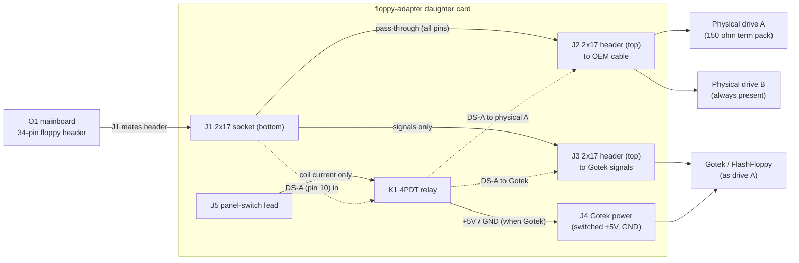

# Floppy adapter — switchable Gotek / physical-drive daughter card

Design spec for issue **#62**. Tracks the floppy interposer personality (#20)
and G2 multi-format support (#30). Derived from
`research/osborne1/floppy-adapter/` (Wayne Visser passive adapter + provenance),
Richard Loxley's Osborne Restoration parts 5 and 12–15, and
`hardware/floppy-adapter/README.md`.

> Status: **design settled 2026-10-10; Rev A schematic captured.**
> Open questions are resolved in §8 with the evidence behind each decision.
> Rev A KiCad capture lives in `hardware/floppy-adapter/`
> (`floppy-adapter.kicad_sch`, generated by `gen_floppy_adapter_sch.py`).

## 1. Purpose

Let the user choose, from a front-panel switch, whether the **drive A** position
is served by the physical drive or by a **Gotek** (FlashFloppy) emulator, with
**drive B always present** in both modes. The card sits between the O1
mainboard/DD-board floppy header and the OEM floppy cable; nothing in the machine
or its cable is cut.

Prior art, deliberately **not** copied:

- Wayne Visser's `Osborne1FloppyAdapter` is a **passive** tap — it puts a Gotek
  on the bus alongside the physical drives and switches nothing. We keep its
  pin/rail mapping as the O1 interface reference.
- Richard Loxley's hand-wired build (parts 12–15) proved the concept but needed a
  DPDT switch + a 5 V relay soldered onto the Gotek, plus hand-cut Dupont cable.
  This design moves all of that onto a PCB at the connector end of the cable.

## 2. Osborne 1 floppy interface (34-pin, Shugart-like)

The O1 uses a Shugart-like 34-pin interface, but with **+5 V and +12 V routed to
the drives over otherwise-unused cable pins** — there are no separate drive power
connectors. The pin functions below were first transcribed from the archived
Wayne Visser adapter (`research/osborne1/floppy-adapter/FloppyAdapter.sch`); they
agree with Loxley's signal audit and the standard Shugart ordering for the shared
signals. **Re-read from the O1 mainboard schematic itself, 2026-10-10** — DWG
1A2011-00 Rev E, sheet 9 of 9 (DISC CONTROLLER), the P8 symbol — see §8.2. That
reading corrected two pins and the GND row.

| Pin(s) | Signal | Notes |
|---|---|---|
| 1,2,3,5,9,19,27,29,31,33 | GND | pin 7 is GND on the drive-end drawing instead; neither 2 nor 7 is a driven signal, so both are tied to GND here |
| **4** | **TG43** | **not GND** (corrected 2026-10-10) — FDC-driven; the drive's write-current-reduce input on 96 tpi drives |
| **6** | **EARLY** | **not GND** (corrected 2026-10-10) — FDC-driven |
| 7 | GND (drive-end drawing) | see note on pin 1 row |
| 8 | INDEX | |
| 10 | DS-A (drive select A) | **the switched line** — Gotek replaces drive A |
| 11,13,15,17 | +12 V | power-over-cable (physical drives) |
| 12 | DS-B (drive select B) | not switched — drive B stays present |
| 14 | *(not drawn on P8)* | |
| 16 | 4 MHz | O1-specific clock; not used by Gotek |
| 18 | DIRECTION | |
| 20 | STEP | |
| 21,23,25 | +5 V | power-over-cable (physical drives; tapped for Gotek) |
| 22 | WRITE DATA | |
| 24 | WRITE GATE | |
| 26 | TRACK 0 | |
| 28 | WRITE PROTECT | |
| 30 | READ DATA | |
| 32 | SIDE SELECT | |
| 34 | LATE | |

Pins 4 and 6 carry live FDC outputs, so the card **passes them straight through
J1 → J2** rather than grounding them. The earlier transcription (from the Visser
adapter) tied 2, 4, 6 and 7 to GND; that is harmless for a Gotek-only adapter,
but this card switches the OEM cable through to the physical drives, and
clamping TG43 low would assert reduced write current permanently.
| 34 | LATE | O1-specific |

The Gotek needs only the static/step/data lines plus its drive-select (Loxley's
11-line audit). The card routes that subset to the Gotek header and leaves 4 MHz
and the spare power pins off it.

## 3. Topology

Everything between J1 and J2 is a **straight pass-through** except pin 10
(DS-A), which is intercepted. The physical drives therefore see an unmodified
cable; the only difference is which device the machine's DS-A reaches.

## 4. Switching design

### 4.1 Drive-select routing (pin 10)
DS-A from the mainboard (J1.10) is the relay common. De-energised it goes to
J2.10 → the physical A drive; energised it goes to J3.10 → the Gotek. Never both,
so the two devices cannot both answer as drive A. DS-B (pin 12) is untouched, so
drive B stays present and selectable in both modes.

### 4.2 Gotek power switching
Loxley's field notes (part 15) are decisive and are the reason this card exists:

- **Switching only +5 V does not turn the Gotek off** — the O1's pulled-up signal
  lines parasitically power the board through its input protection diodes.
- **Switching only GND makes the *other* drive unreliable** — the Gotek's signal
  lines are still referenced to the shared 5 V.
- **Switching both +5 V and GND works.** That is what this card does.

Consequence: the Gotek's **GND and +5 V must arrive only through J4**, *not*
through the J3 header, otherwise switching GND has no effect. J3 carries signals
only.

### 4.3 Switch element — mechanical relay (recommended)
A single **4PDT relay** (3 poles used, 1 spare) does all three switches at once:

| Pole | Contact | Function |
|---|---|---|
| 1 | NO | switched +5 V → Gotek (J4) |
| 2 | NO | switched GND → Gotek (J4) |
| 3 | NC / NO | DS-A → physical A (J2.10) / Gotek (J3.10) |
| 4 | — | spare (e.g. front-panel LED) |

- Coil: 5 V, ~72 mA (Omron G6A-434P 5 VDC: 69 Ω, ~360 mW), fed from the cable's
  +5 V through the panel switch J5.
- De-energised = physical drives (**fail-safe**): a broken/unplugged switch lead
  parks the machine on the physical drives.
- The relay only ever switches a **static DC select line** and the power rails —
  no stepped/data signal passes through the contacts, so contact bounce/bandwidth
  are irrelevant. A mid-switch transient is a single floppy error the machine
  tolerates (per the author's experience).
- Add a flyback diode across the coil and a 10 kΩ pull-down on the coil+ node so
  a disconnected switch is deterministic.
- The panel switch carries only coil current — never drive power, as the existing
  README requires.

### 4.4 Solid-state alternative (optional, smaller/silent)
If the relay is unwanted, the same three functions can be built from silicon:
a P-MOSFET high-side load switch (e.g. AO3401) + N-MOSFET low-side switch
(AO3400/2N7002) for the rails, and a 2:1 analog/bus switch (74HC4053 or
74CBT-class, 5 V-capable) for DS-A, all driven from one logic input. More parts
and more 5 V-level care, but no coil current, no click, and lower profile.
Recommendation: **relay for Rev A**, evaluate solid-state for Rev B.

### 4.5 Termination and pull-ups (why drive A matters)
The O1 terminates the floppy bus with a **150 Ω resistor pack on every signal
line, located in physical drive A** — the drive at the far end of the cable.
Drive B has no termination (Loxley parts 5 and 12). Two consequences:

- The shared signal lines stay terminated in both modes, because only DS-A is
  switched: drive A remains connected to every other line, so its 150 Ω pack
  stays on the bus even when the Gotek is selected.
- **DS-A loses its pull-up in Gotek mode.** The 150 Ω pull-up lives at drive A;
  routing DS-A to the Gotek disconnects it. The Gotek has **1 kΩ pull-ups on most
  lines but none on the drive-select lines** (Loxley part 5), so a floating DS-A
  is exactly the failure Loxley chased for days.

→ **Add an on-card pull-up on the Gotek-side DS-A net** (relay NO contact →
J3.10): **1 kΩ default, with a 150 Ω option** (jumper or second footprint) to
match the O1's own termination. This is the single most important addition to
the original concept, and it exists only because the Gotek replaces drive A
rather than drive B. Loxley tried both 1 kΩ and 150 Ω on the select lines.

## 5. Reference schematic (Rev A, netlist level)

Components:

| Ref | Part | Notes |
|---|---|---|
| J1 | 2×17 socket, 2.54 mm | bottom, mates O1 mainboard header |
| J2 | 2×17 header, 2.54 mm | top, OEM cable → physical drives |
| J3 | 2×17 header, 2.54 mm | top, Gotek (signals only) |
| J4 | 4-pin header (floppy power) | switched +5 V / GND to Gotek |
| J5 | 2-pin header | front-panel switch lead |
| K1 | 4PDT relay, 5 V coil (e.g. Omron G6A-434P) | 3 poles used |
| D1 | 1N4148 | coil flyback |
| R1 | 10 kΩ | coil-node pull-down |
| R3 | 1 kΩ | DS-A pull-up, Gotek side, default (§4.5) |
| R4 | 150 Ω (DNP) | DS-A pull-up alternative — fit R3 **or** R4 (§4.5) |
| R2, D2 | 1 kΩ + LED (optional) | front-panel "Gotek active" indicator |

Connections (pin n of J1 unless stated):

- **Pass-through:** J1.n → J2.n for every pin **except 10**. This carries the
  signals *and* the +5 V / +12 V / GND rails to the physical drives unchanged.
- **DS-A:** J1.10 → K1 pole-3 common. Pole-3 NC → J2.10 (physical A). Pole-3 NO
  → J3.10 (Gotek).
- **DS-A pull-up:** R3 (1 kΩ default; 150 Ω option) from the J3.10 net to +5 V,
  on the Gotek side of the relay (§4.5).
- **Gotek signals:** J1 pins 8, 18, 20, 22, 24, 26, 28, 30 (and optionally 32, 34)
  → the matching pins of J3. J3 pins 12, 14, 16 and all GND/power pins are **NC**.
- **Gotek +5 V:** J1 +5 V (21/23/25) → K1 pole-1 common; pole-1 NO → J4 (+5 V).
- **Gotek GND:** board GND → K1 pole-2 common; pole-2 NO → J4 (GND).
- **Coil:** J1 +5 V → J5.1 → (panel switch) → J5.2 → K1 coil+ ; K1 coil− → GND.
  D1 across the coil (cathode to coil+). R1 from coil+ to GND. Optional R2+D2
  from coil+ to GND for the indicator.

## 6. BOM (Rev A)

| Qty | Item | Notes |
|---|---|---|
| 1 | 4PDT relay, 5 V coil, DIP-14 | Omron G6A-434P-ST-US (or equivalent) |
| 1 | 2×17 socket, 2.54 mm, vertical | bottom mezzanine |
| 2 | 2×17 header, 2.54 mm, vertical | top (cable + Gotek) |
| 1 | 4-pin header (floppy power) | Gotek power, right-angle |
| 1 | 2-pin header | panel switch |
| 1 | 1N4148 | flyback |
| 1 | 10 kΩ 0805/TH | coil-node pull-down |
| 1 | 1 kΩ 0805/TH | DS-A pull-up (R3, default) |
| 1 | 150 Ω 0805/TH (DNP) | DS-A pull-up alternative (R4) |
| 1 | 1 kΩ + LED | optional indicator |
| 1 | PCB, 2-layer, 1.6 mm | ENIG preferred (relay/contacts, mating) |

## 7. Physical design brief

**Board (PCB).**
- 2-layer, 1.6 mm FR4; ground plane on the bottom layer; +5 V/GND traces
  ≥ 0.5 mm (Gotek ~0.3–0.5 A).
- Envelope to be fixed against the mainboard keep-outs
  (`research/osborne1/OCC1_1A2011-00_Schem_RevE.pdf`) and host photos
  (`research/pictures/`); target a compact card that clears the DD board.
- J1 (socket) on the bottom face, positioned to engage the mainboard 34-pin
  header; add 2 mounting holes/standoffs so the mezzanine cannot rock.
- J2 and J3 on the top face; orient both so the OEM ribbon and the Gotek ribbon
  exit without fouling. Silk-label each connector, mark pin 1, and label
  "O1 IN", "→ DRIVES", "GOTEK", "GOTEK 5V", "SWITCH".

**Gotek mount (3D-printed part).**
- The Gotek (top cover removed) fits a floppy storage pocket; with its top
  headers fitted it is too tall, so connect it by a slim pigtail/direct-wire pads
  rather than plugging a header on top.
- Design a printed bracket/faceplate that holds the Gotek in the pocket at the
  right depth, exposes the USB port, and carries the panel switch. This is the
  "Modification to support Gotek drives with 3D-printed floppy-disk faceplate"
  write-up planned in `site/README.md`.
- Cable egress: a full 34-pin ribbon will not pass the pocket vent slots. Run the
  Gotek on a reduced signal set (the §5 lines + power) on a narrower cable, or
  route through the "Ext Video" port as Loxley did.

**Panel switch.**
- Plain panel-mount SPST (or SPDT for an indicator). 2-wire lead to J5; no drive
  power on the lead. Mount next to the Gotek pocket.

**Reversibility.** No cable or machine modification: unplug the card and the
machine is stock.

## 8. Open questions / decisions (settled 2026-10-10)

All seven items are now closed. Each carries the evidence it rests on; the two
that remain bench-verifiable are flagged as such.

1. **Drive topology — CONFIRMED (user, 2026-10-10).** The switch selects **drive
   A** (physical A ↔ Gotek); **drive B stays present** in both modes.

2. **Connector genders — CONFIRMED.** The O1 logic board's floppy connector is
   **P8, a 34-pin MALE header**. The Field Service Manual (2F00040) instructs
   "Attach the disk harness to the 34-pin connection on the logic board … Be
   careful not to bend any pins", and the double-density adaptor's "sockets …
   fit onto the logic board disk harness connector (P8)". The harness is a
   **female IDC socket** and is **not keyed** — "the RED stripe on the harness
   must be to the RIGHT" fixes pin 1. Therefore **J1 = female 2x17 socket**
   (card bottom) and **J2 = male 2x17 header** (OEM cable). Pin order is
   confirmed in §2.

3. **Switch element — DECIDED: electromechanical relay (Rev A).** A single 4PDT
   relay does all three switches with no 5 V-level silicon and no signal-path
   parts (§4.3). The contacts only ever carry a static DC select line and the
   power rails, so contact bandwidth/bounce are irrelevant. Solid-state (§4.4)
   stays a **Rev B** option if the click, coil current or height become issues.

4. **Isolation depth — DECIDED: Loxley's proven minimum.** Switch **DS-A + both
   power rails** and nothing else. The shared signal lines are *not* additionally
   gated: doing so adds series elements to a 4 MHz-class bus for no proven
   benefit, and the failure Loxley actually chased (a Gotek that would not power
   down) is fixed by the dual-rail switch alone. Full signal gating is recorded
   as a Rev B experiment, not Rev A scope.

5. **DS-A pull-up — CONFIRMED 1 kΩ default, 150 Ω option.** The FSM settles the
   termination location: "The A drive has an 8 pin 150 OHM Terminator resistor
   pack. B DRIVE DOES NOT." So when DS-A is routed to the Gotek it loses the
   O1's 150 Ω pull-up, and the Gotek has no pull-up on its drive-select lines
   (Loxley part 5). The card therefore fits **R3 = 1 kΩ** as the default and
   **R4 = 150 Ω** as an alternative footprint (fit exactly one) on the
   Gotek-side DS-A net.

6. **Gotek drive-select jumper — SETTLED (bench-verify).** The Gotek must answer
   the O1's **drive-A** select, which is cable **pin 10**. The Gotek manual
   labels the jumpers `S0 = Drive Select 0` / `S1 = Drive Select 1`, and
   FlashFloppy's generic guidance for a Shugart host is "unit 0 → place the
   selection jumper at **S0**". The O1, however, straps its drive A as **DS1**
   (FSM 8.1.4.11: "Drive A has a jumper at positions HM and DS1"), and the
   proven O1 adapter (`WayneVisser/Osborne1FloppyAdapter`) notes "Jumper only
   **S1** on the GoTek". **Start with S1**; if the Gotek is not seen, move to
   S0. This is a 30-second bench check and the card is agnostic to it.

7. **Gotek cable route / bracket — DECIDED.** Gotek in the **right-hand floppy
   storage pocket** (Loxley part 14), driven from a **reduced ~12-line pigtail**
   that passes the pocket vent slots (a full 34-pin ribbon does not fit), with a
   3D-printed faceplate/bracket carrying the Gotek and the panel switch. This is
   the "Modification to support Gotek drives with 3D-printed floppy-disk
   faceplate" write-up planned in `site/README.md` (§7).

### Evidence added 2026-10-10

- **O1 Field Service Manual 2F00040** (`research/osborne1/`): 150 Ω terminator is
  on drive A only; logic-board connector P8 is male; harness not keyed, red
  stripe = pin 1; drive A strapped DS1.
- **O1 mainboard schematic, DWG 1A2011-00 Rev E sheet 9 of 9 (DISC CONTROLLER)**
  (`research/osborne1/OCC1_1A2011-00_Schem_RevE.pdf`, PDF page 12): the P8
  34-pin header — GND = `1,2,3,5,9,19,27,29,31,33`; +12 V = 11,13,15,17;
  +5 V = 21,23,25; **pin 4 = TG43 and pin 6 = EARLY, neither is GND**; pins 7
  and 14 are not drawn at all; DS-A/DS-B on 10/12. Read at 600–1200 dpi; see
  `docs/o1-mainboard-schematic.md` §5 (#62).
- **O1 disk-electronics schematic, DWG 1A3004-00/01 Rev C sheets 1–3** (PDF
  pages 1–3 of the same file — a *different* drawing, the drive's own board):
  head/drive connectors P1/P2; P2 lists GND = `1,3,5,7,9,19,27,29,31,33` and
  CASE = 32. It disagrees with P8 on pin 2 versus pin 7, which is harmless —
  neither is a driven signal on the O1, so the card ties both to GND.
- **Gotek SFR1M44-U100K user manual**: jumper table `S0 = Drive Select 0`,
  `S1 = Drive Select 1`, `MO = Motor On`, `JA = READY on 34-pin interface`.
- **FlashFloppy wiki — Initial Setup / Gotek Models**: Shugart hosts expect
  unit 0 → jumper `S0`.
- **Omron G6A-434P** datasheet: 4PDT DIP-14 through-hole relay; 5 VDC coil =
  72.5 mA / 69 Ω / ~360 mW; contacts 1 A 30 VDC (ST-US).
- **Richard Loxley, Osborne Restoration parts 5 and 12–15**: 150 Ω pack at the
  far drive; Gotek has 1 kΩ on most lines but not on drive select; switching
  only +5 V leaves the Gotek parasitically powered, only GND upsets the other
  drive — switch both.

## 9. Rev A schematic capture

Captured 2026-10-10 as `hardware/floppy-adapter/floppy-adapter.kicad_sch`
(KiCad 7 format), generated by `gen_floppy_adapter_sch.py` — the same
generate-then-normalise pattern as the interposer boards.

- **J1** female 2x17 socket (O1 logic-board P8), **J2** 2x17 header (OEM cable),
  **J3** 2x17 header (Gotek signals), **J4** 1x04 header (switched Gotek power),
  **J5** 1x02 header (panel switch), **K1** 4PDT relay, **D1** 1N4148 flyback,
  **R1** 10 kΩ coil pull-down, **R3/R4** DS-A pull-up, **R2+D2** optional
  indicator.
- Every J1 pin except DS-A (10) is labelled straight through to J2. DS-A is the
  relay common (K1 pole 3); its NC contact returns to J2.10, its NO contact goes
  to J3.10. `+5V`/`GND` reach the Gotek only via K1 poles 1/2 → J4; the J3 header
  is signals-only, and +12 V, 4 MHz and pin 14 never reach the Gotek.
- Nets are joined by labels, so the pin/relay mapping can be edited without
  re-routing. Verified with `kicad-cli sch export netlist` (netlist matches the
  net table above) and `kicad-cli sch erc` (0 errors).

Two known follow-ups at layout time: the **relay pin numbers are DIP-14 logical
placeholders** (confirm against the chosen relay's terminal arrangement), and no
**footprint** is assigned yet (KiCad has no G6A-434P footprint; create one or use
a 4PDT socket).

## 10. References
- Issue #62 (this design); feeds #20 (floppy interposer), #30 (G2 multi-format).
- `research/osborne1/floppy-adapter/` — Wayne Visser passive adapter + PROVENANCE.
- `research/osborne1/OCC1_1A2011-00_Schem_RevE.pdf` — mainboard schematic.
- `hardware/floppy-adapter/README.md` — concept summary.
- Richard Loxley, Osborne Restoration **part 5** (150 Ω term pack at the far
  drive; Gotek has 1 kΩ on most lines but *not* drive select) and **parts 12–15**
  (A drive has 150 Ω, B has none; DPDT + relay switching lesson).

