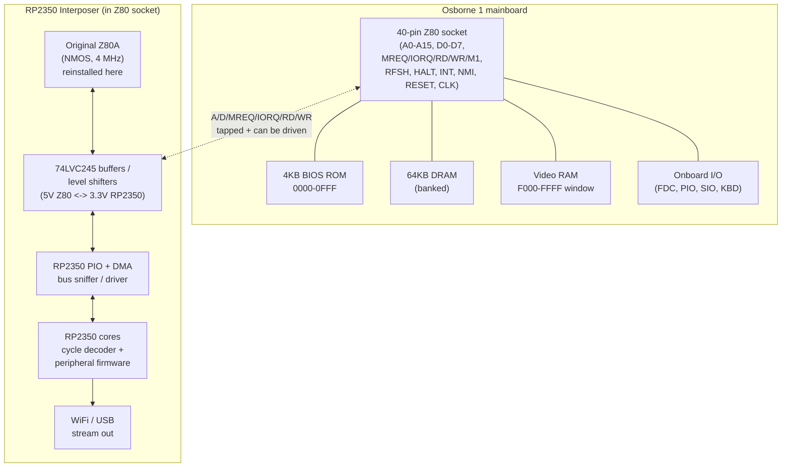
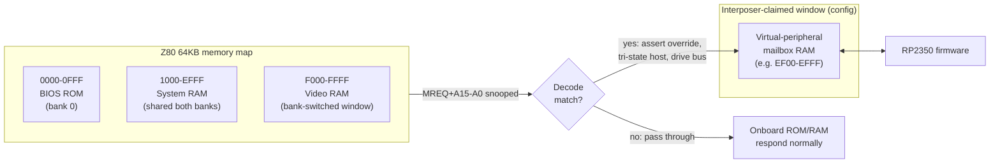
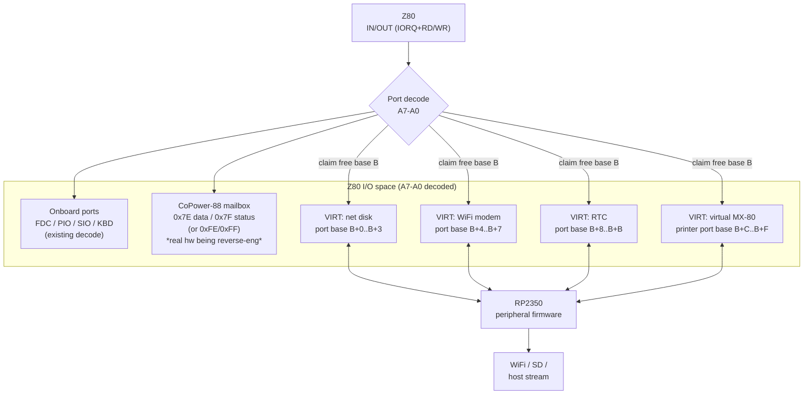
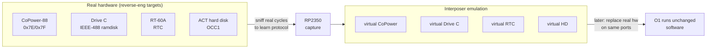

# O1 Interposer — Virtual Peripherals: Bus & Address-Space Block Diagram

How the RP2350 interposer sits on the Z80 bus and where each virtual
peripheral lives in the Osborne 1 memory and I/O maps.

## 1. Where the interposer physically sits

The Osborne 1 exposes the Z80 on a 40-pin DIP socket. Like the
CoPower-88 and the OCC ScreenPac, the interposer **plugs into the Z80
socket** and the Z80 plugs into the interposer — so it sees (and can
drive) every bus cycle.

**Level shifting note (#11):** the host Z80A is NMOS (confirmed, date
8408). NMOS outputs are TTL-ish; NMOS inputs have ~2.0–2.4 V high
thresholds. Use **74AHCT/74HCT toward the Z80** (TTL-compatible inputs)
and **74LVC245 host-side**. ScreenPac used raw 74HC; we prefer AHCT/LVC
for margin across all three target machines.

## 2. Z80 memory map and where virtual devices attach

The O1 banks ROM, RAM, and video in a 64KB space. The interposer claims
a small decode window by **snooping MREQ and either passing through or
overriding** the onboard response.

### Banking caveat
The O1 video RAM and BIOS share the top of the map via a bank-select
I/O bit. Any memory-resident virtual device must **(a)** live in an
address range the current bank exposes and **(b)** defer to the real
video RAM when it is mapped in. Safest is a small mailbox page in the
always-present RAM region, or an I/O-port device instead (below).

## 3. Z80 I/O map and the virtual-peripheral ports

I/O-mapped devices are cleaner: they never collide with the memory
banks and are how every real O1 peripheral (and the CoPower-88) already
works.

**Port-base strategy:** pick a base `B` in a region the onboard decode
leaves free **and** that does not collide with the CoPower-88's
0x7E/0x7F (Kaypro) or 0xFE/0xFF (Zorba) — so the interposer can
*emulate or coexist with* the real CoPower. The comparator-based decode
on the real CoPower board (the "16-2103" IC, see photo-survey) is the
model for a clean single-port-pair decode.

## 4. The four virtual peripherals (from the roadmap)

| Virtual peripheral | Bus type | Address/Port | Host interface | Back end |
|---|---|---|---|---|
| **Network disk** | I/O ports | base+0..3 (cfg) | command/data/status FIFO | SD image / WiFi block server |
| **WiFi modem** | I/O ports | base+4..7 (cfg) | 8250-ish UART regs | TCP/Telnet over WiFi |
| **RTC** | I/O ports | base+8..B (cfg) | RT-60A-compatible regs (see #7) | RP2350 RTC / NTP |
| **Virtual MX-80 printer** | I/O ports | base+C..F (cfg) | Centronics-style data+strobe | WiFi / USB to host spooler |

Each is an independent decode window; firmware registers a
`{base, mask, read_fn, write_fn}` entry and the cycle decoder dispatches.

## 5. Coexistence with the real peripherals being reverse-engineered

The interposer first **passively sniffs** each real device to pin its
protocol (the reverse-engineering phase), then can **emulate** it on the
same decode so the original software runs against the virtual version.
